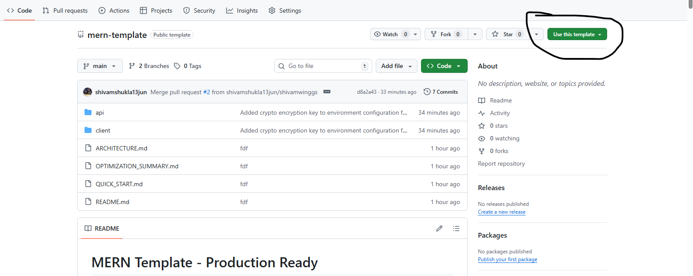

# MERN Template - Production Ready
## 🚀 How to Use This Template

1. Open this repository on GitHub
2. Click on **Use this template** (top-right)



3. Choose **Create a new repository**
4. Give your project a name
5. Click **Create repository**
A production-ready full-stack MERN (MongoDB, Express, React, Node.js) template with TypeScript, featuring clean architecture, Redis caching, role-based access control, and comprehensive documentation.

## 📚 Documentation

- **[Quick Start Guide](./QUICK_START.md)** - Get up and running in 5 minutes
- **[Architecture Documentation](./ARCHITECTURE.md)** - Detailed architecture and design patterns
- **[API Documentation](http://localhost:3000/api-docs)** - Interactive Swagger documentation (after starting the server)

## 🏗️ Architecture Overview

This project follows a **clean, modular architecture** with the following stack:

### Backend (Node.js + TypeScript + Express)
- **Auth Service**: JWT authentication, refresh tokens, password reset
- **User Service**: User management with RBAC
- **Permission Service**: Role-based access control
- **Session Management**: Redis-backed sessions
- **API Documentation**: Auto-generated Swagger docs

### Frontend (React 19 + TypeScript + Vite)
- **State Management**: Redux Toolkit + Redux Persist
- **UI Framework**: Material-UI (MUI)
- **Routing**: React Router v6 with protected routes
- **API Integration**: Axios with interceptors
- **Form Validation**: Zod schemas

### Infrastructure
- **MongoDB**: Primary database with Mongoose ODM
- **Redis**: Session storage and caching
- **RabbitMQ**: Message queuing (optional, configured but not active)

## 🚀 Features

### Authentication & Authorization
- ✅ JWT authentication with refresh tokens
- ✅ Role-based access control (RBAC)
- ✅ Password reset via email
- ✅ Session management with Redis
- ✅ Protected routes on frontend

### Backend Features
- ✅ Clean modular architecture
- ✅ Auto-generated Swagger documentation
- ✅ Input validation with Zod
- ✅ Centralized error handling
- ✅ File upload support
- ✅ Email service (Nodemailer)
- ✅ Logging with Winston
- ✅ Security (Helmet, CORS, Rate limiting)
- ✅ TypeScript for type safety

### Frontend Features
- ✅ Modern React 19 with TypeScript
- ✅ Redux Toolkit for state management
- ✅ Encrypted state persistence (IndexedDB)
- ✅ Material-UI components
- ✅ Responsive design
- ✅ Code splitting & lazy loading
- ✅ Form validation with Zod
- ✅ Toast notifications
- ✅ Protected routes with RBAC

## 📋 Prerequisites

Before running this project, ensure you have:

- **Node.js** (v18 or higher)
- **MongoDB** (v6 or higher)
- **Redis** (v7 or higher)
- **npm** or **yarn**

**Note**: RabbitMQ is configured but optional. The application works without it.

## 🛠️ Quick Installation

> **For detailed setup instructions, see [QUICK_START.md](./QUICK_START.md)**

### 1. Install Dependencies

```bash
# Backend
cd api
npm install

# Frontend
cd client
npm install
```

### 2. Configure Environment

```bash
# Backend
cd api
cp .env.example .env
# Edit .env with your configuration

# Frontend
cd client
cp .env.example .env
# Edit .env with your configuration
```

### 3. Start Services

```bash
# Start MongoDB (using Docker)
docker run -d -p 27017:27017 --name mongodb mongo:latest

# Start Redis (using Docker)
docker run -d -p 6379:6379 --name redis redis:latest
```

### 4. Run Applications

```bash
# Backend (Terminal 1)
cd api
npm run dev

# Frontend (Terminal 2)
cd client
npm run dev
```

### 5. Access the Application

- **Frontend**: http://localhost:5174
- **Backend API**: http://localhost:3000
- **API Documentation**: http://localhost:3000/api-docs

### Default Login Credentials

- **Super Admin**: `superadmin@example.com` / `SuperAdmin@123`
- **Admin**: `admin@example.com` / `Admin@123`
- **User**: `user@example.com` / `User@123`

## 📚 API Endpoints

### Authentication
- `POST /api/auth/register` - Register new user
- `POST /api/auth/login` - User login
- `POST /api/auth/refresh-token` - Refresh access token
- `POST /api/auth/logout` - User logout
- `POST /api/auth/forgot-password` - Request password reset
- `POST /api/auth/reset-password` - Reset password

### Users
- `GET /api/users` - Get all users (Admin)
- `GET /api/users/:id` - Get user by ID
- `POST /api/users` - Create user (Admin)
- `PUT /api/users/:id` - Update user
- `DELETE /api/users/:id` - Delete user (Admin)

### Permissions
- `GET /api/permissions` - Get all permissions
- `POST /api/permissions` - Create permission (Super Admin)
- `PUT /api/permissions/:id` - Update permission
- `DELETE /api/permissions/:id` - Delete permission

**Full interactive documentation**: http://localhost:3000/api-docs

## 🗄️ Database Schema

### User Collection
```typescript
{
  name: string;
  email: string;
  password: string;
  role: Role;
  isActive: boolean;
  isBlocked: boolean;
  createdBy?: Types.ObjectId;
  updatedBy?: Types.ObjectId;
  manager?: Types.ObjectId;
  resetPasswordToken?: string;
  resetPasswordExpire?: Date;
  createdAt: Date;
  updatedAt: Date;
}
```

### Session Collection (TTL - Auto Expire)
```typescript
{
  expires: Date;
  session: {
    userId?: string;
    key: string;
    iv: string;
    createdAt?: number;
    [key: string]: any;
  };
}
```

### Role Permission Collection
```typescript
{
  role: string;
  permissions: Array<{
    resource: string;
    actions: string[];
  }>;
  createdAt: Date;
  updatedAt: Date;
}
```

## 🔧 Configuration

### Environment Variables

#### Backend (.env)
| Variable | Description | Default |
|----------|-------------|---------|
| `NODE_ENV` | Environment mode | `development` |
| `PORT` | Server port | `3000` |
| `MONGO_URI` | MongoDB connection string | `mongodb://localhost:27017/ecommerce` |
| `JWT_SECRET` | JWT secret key | - |
| `REFRESH_TOKEN_SECRET` | Refresh token secret | - |
| `REDIS_HOST` | Redis host | `127.0.0.1` |
| `REDIS_PORT` | Redis port | `6379` |
| `FRONTEND_URL` | Frontend URL for CORS | `http://localhost:5174` |

#### Frontend (.env)
| Variable | Description | Default |
|----------|-------------|---------|
| `VITE_API_URL` | Backend API URL | `http://localhost:3000` |
| `VITE_API_INDEX_DB_STORAGE` | Encryption key for state | - |

**See `.env.example` files for complete configuration options.**

## 🔒 Security Features

- ✅ JWT token-based authentication
- ✅ Password hashing with bcrypt
- ✅ Redis session management
- ✅ CORS protection
- ✅ Helmet security headers
- ✅ Rate limiting
- ✅ Input validation
- ✅ XSS protection
- ✅ Encrypted state storage (frontend)

## 📖 Project Structure

```
mern-template/
├── api/                          # Backend application
│   ├── src/
│   │   ├── config/              # Configuration files
│   │   ├── microservices/       # Feature modules (auth, user, permissions)
│   │   ├── middlewares/         # Express middlewares
│   │   ├── routes/              # Route definitions
│   │   ├── services/            # Business logic
│   │   ├── utils/               # Utility functions
│   │   └── server.ts            # Application entry point
│   └── package.json
│
└── client/                      # Frontend application
    ├── src/
    │   ├── components/          # Reusable components
    │   ├── pages/               # Page components
    │   ├── redux/               # State management
    │   ├── routes/              # Route configuration
    │   ├── service/             # API services
    │   └── main.tsx             # Application entry point
    └── package.json
```

## 🧪 Testing

```bash
# Backend tests (when implemented)
cd api
npm test

# Frontend tests (when implemented)
cd client
npm test
```

## 🚀 Deployment

### Backend Deployment

```bash
cd api
npm run build
npm start
```

### Frontend Deployment

```bash
cd client
npm run build
# Serve the dist/ folder with your preferred hosting service
```

## 🤝 Contributing

1. Fork the repository
2. Create your feature branch (`git checkout -b feature/AmazingFeature`)
3. Commit your changes (`git commit -m 'Add some AmazingFeature'`)
4. Push to the branch (`git push origin feature/AmazingFeature`)
5. Open a Pull Request

## 📝 License

This project is licensed under the MIT License.

## 🙏 Acknowledgments

- Built with modern MERN stack
- Inspired by clean architecture principles
- Designed for scalability and maintainability

---

**For more detailed information:**
- 📖 [Architecture Documentation](./ARCHITECTURE.md)
- 🚀 [Quick Start Guide](./QUICK_START.md)
- 📚 [API Documentation](http://localhost:3000/api-docs)
