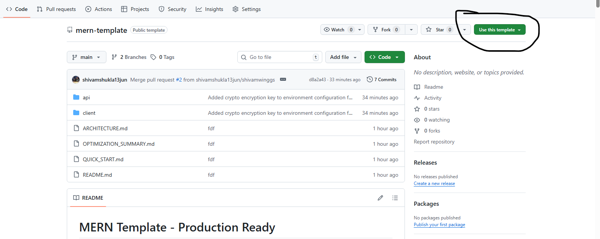

# MERN Template - Production Ready
## 🚀 How to Use This Template

1. Open this repository on GitHub
2. Click on **Use this template** (top-right)



3. Choose **Create a new repository**
4. Give your project a name
5. Click **Create repository**
A production-ready full-stack MERN (MongoDB, Express, React, Node.js) template with TypeScript, featuring clean architecture, Redis caching, role-based access control, and comprehensive documentation.

## 📚 Documentation

- **[Quick Start Guide](./QUICK_START.md)** - Get up and running in 5 minutes
- **[Architecture Documentation](./ARCHITECTURE.md)** - Detailed architecture and design patterns
- **[API Documentation](http://localhost:3000/api-docs)** - Interactive Swagger documentation (after starting the server)

## 🏗️ Architecture Overview

This project follows a **clean, modular architecture** with the following stack:

### Backend (Node.js + TypeScript + Express)
- **Auth Service**: JWT authentication, refresh tokens, password reset
- **User Service**: User management with RBAC
- **Permission Service**: Role-based access control
- **Session Management**: Redis-backed sessions
- **API Documentation**: Auto-generated Swagger docs


### Infrastructure
- **MongoDB**: Primary database with Mongoose ODM
- **Redis**: Session storage and caching
- **RabbitMQ**: Message queuing (optional, configured but not active)

## 🚀 Features

### Authentication & Authorization
- ✅ JWT authentication with refresh tokens
- ✅ Role-based access control (RBAC)
- ✅ Password reset via email
### Backend Features
- ✅ Clean modular architecture
- ✅ Auto-generated Swagger documentation
- ✅ Input validation with Zod
- ✅ Centralized error handling
- ✅ File upload support
- ✅ Email service (Nodemailer)
- ✅ Logging with Winston
- ✅ Security (Helmet, CORS, Rate limiting)
- ✅ TypeScript for type safety

## 📋 Prerequisites

Before running this project, ensure you have:

- **Node.js** (v18 or higher)
- **MongoDB** (v6 or higher)
- **Redis** (v7 or higher)
- **npm** or **yarn**

**Note**: RabbitMQ is configured but optional. The application works without it.

## 🛠️ Quick Installation

> **For detailed setup instructions, see [QUICK_START.md](./QUICK_START.md)**

### 1. Install Dependencies

```bash


### 1. Configure Environment

```bash
# Backend
npm i
cp .env.example .env
# Edit .env with your configuration

```

### 2. Start Services

```bash
# Start MongoDB (using Docker)
docker run -d -p 27017:27017 --name mongodb mongo:latest

# Start Redis (using Docker)
docker run -d -p 6379:6379 --name redis redis:latest
```

### 3. Run Applications

```bash
# Backend (Terminal 1)
npm run dev

```

### 4. Access the Application

- **Backend API**: http://localhost:3000
- **API Documentation**: http://localhost:3000/api-docs

### Default Login Credentials

- **Super Admin**: `superadmin@example.com` / `SuperAdmin@123`
- **Admin**: `admin@example.com` / `Admin@123`
- **User**: `user@example.com` / `User@123`

## 📚 API Endpoints

### Authentication
- `POST /api/auth/register` - Register new user
- `POST /api/auth/login` - User login
- `POST /api/auth/refresh-token` - Refresh access token
- `POST /api/auth/logout` - User logout
- `POST /api/auth/forgot-password` - Request password reset
- `POST /api/auth/reset-password` - Reset password

### Users
- `GET /api/users` - Get all users (Admin)
- `GET /api/users/:id` - Get user by ID
- `POST /api/users` - Create user (Admin)
- `PUT /api/users/:id` - Update user
- `DELETE /api/users/:id` - Delete user (Admin)


**Full interactive documentation**: http://localhost:3000/api-docs

## 🗄️ Database Schema

### User Collection
```typescript
{
  name: string;
  email: string;
  password: string;
  role: Role;
  isActive: boolean;
  isBlocked: boolean;
  createdBy?: Types.ObjectId;
  updatedBy?: Types.ObjectId;
  resetPasswordToken?: string;
  resetPasswordExpire?: Date;
  createdAt: Date;
  updatedAt: Date;
}
```

## 🔧 Configuration

### Environment Variables

#### Backend (.env)
| Variable | Description | Default |
|----------|-------------|---------|
| `NODE_ENV` | Environment mode | `development` |
| `PORT` | Server port | `3000` |
| `MONGO_URI` | MongoDB connection string | `mongodb://localhost:27017/your_db` |
| `JWT_SECRET` | JWT secret key | - |
| `REFRESH_TOKEN_SECRET` | Refresh token secret | - |
| `REDIS_HOST` | Redis host | `127.0.0.1` |
| `REDIS_PORT` | Redis port | `6379` |


**See `.env.example` files for complete configuration options.**

## 🔐 JWT Authentication Guidelines

### Overview
This application uses **JWT (JSON Web Token)** authentication with the following features:
- Standalone JWT tokens (not session-based)
- Automatic token expiration with MongoDB TTL indexes
- Token refresh mechanism for long-lived sessions
- Token revocation on logout

### Token Types

| Token Type | Lifetime | Purpose | Storage |
|-----------|----------|---------|---------|
| Access Token | 1 hour (configurable) | Authorize API requests | Client-side |
| Refresh Token | 7 days | Generate new access tokens | Client-side |

### Authentication Flow

#### 1. **Login** - Get Both Tokens
```bash
POST /api/auth/login
Content-Type: application/json

{
  "email": "user@example.com",
  "password": "password123"
}
```

**Response:**
```json
{
  "success": true,
  "data": {
    "user": { "_id": "...", "email": "...", "role": "..." },
    "accessToken": "eyJhbGciOiJIUzI1NiIsInR5cCI6IkpXVCJ9...",
    "refreshToken": "eyJhbGciOiJIUzI1NiIsInR5cCI6IkpXVCJ9...",
    "expiresIn": 3600
  },
  "message": "Login successful"
}
```

#### 2. **Use Access Token** - Call Protected APIs
```bash
GET /api/auth/current-user
Authorization: Bearer <accessToken>
```

#### 3. **Refresh Token** - When Access Token Expires
```bash
POST /api/auth/refresh-token
Content-Type: application/json

{
  "refreshToken": "eyJhbGciOiJIUzI1NiIsInR5cCI6IkpXVCJ9..."
}
```

**Response:**
```json
{
  "success": true,
  "data": {
    "accessToken": "eyJhbGciOiJIUzI1NiIsInR5cCI6IkpXVCJ9...",
    "expiresIn": 3600
  },
  "message": "Token refreshed successfully"
}
```

#### 4. **Logout** - Revoke Token
```bash
POST /api/auth/logout
Authorization: Bearer <accessToken>
```

### Backend Implementation

#### Key Files
- **JWT Utilities**: `src/libs/jwt.ts` - Token generation, verification, and management
- **Token Model**: `src/models/token.model.ts` - MongoDB token storage with TTL
- **Auth Controller**: `src/microservices/auth-service/auth.controller.ts` - Login, refresh, logout
- **Auth Middleware**: `src/middlewares/index.ts` - Middleware.verifyToken() for protected routes

#### Using Protected Routes
```typescript
// Import middleware
import { Middleware } from 'middlewares';

// Apply to routes
router.get('/protected-route', Middleware.verifyToken, controllerFunction);
```

The middleware will:
1. Extract token from `Authorization: Bearer <token>` header
2. Validate JWT signature
3. Check token exists in database (not revoked)
4. Load user and attach to `req.user`

### Frontend Implementation (Example with React)

```javascript
// 1. Login
const login = async (email, password) => {
  const res = await fetch('/api/auth/login', {
    method: 'POST',
    body: JSON.stringify({ email, password })
  });
  const data = await res.json();
  
  localStorage.setItem('accessToken', data.data.accessToken);
  localStorage.setItem('refreshToken', data.data.refreshToken);
};

// 2. Make API calls with token
const apiCall = async (url) => {
  const token = localStorage.getItem('accessToken');
  const res = await fetch(url, {
    headers: { 'Authorization': `Bearer ${token}` }
  });
  
  // If 401, refresh token
  if (res.status === 401) {
    await refreshAccessToken();
    return apiCall(url); // Retry
  }
  return res.json();
};

// 3. Refresh token
const refreshAccessToken = async () => {
  const refreshToken = localStorage.getItem('refreshToken');
  const res = await fetch('/api/auth/refresh-token', {
    method: 'POST',
    body: JSON.stringify({ refreshToken })
  });
  
  const data = await res.json();
  localStorage.setItem('accessToken', data.data.accessToken);
};

// 4. Logout
const logout = async () => {
  const token = localStorage.getItem('accessToken');
  await fetch('/api/auth/logout', {
    method: 'POST',
    headers: { 'Authorization': `Bearer ${token}` }
  });
  
  localStorage.removeItem('accessToken');
  localStorage.removeItem('refreshToken');
};
```

### Environment Configuration

**Required in `.env` file:**
```bash
JWT_SECRET=your-super-secret-key-change-this
REFRESH_TOKEN_SECRET=your-refresh-secret-key-change-this
JWT_EXPIRE=1h  # Can be: '1h', '2h', '30m', '3600' (seconds)
```

### Security Best Practices

✅ **Do**:
- Store tokens in `localStorage` or secure `httpOnly` cookies
- Include token in `Authorization: Bearer <token>` header
- Implement token refresh logic before expiration
- Clear tokens on logout
- Handle token expiration gracefully
- Use HTTPS in production

❌ **Don't**:
- Store tokens in plain text in HTML
- Log tokens to console in production
- Commit JWT secrets to git
- Use weak secrets (use strong random strings)
- Store tokens in `sessionStorage` (clears on tab close)

### Database TTL Management

Tokens are automatically deleted from MongoDB after expiration via TTL indexes. No manual cleanup needed.

**Manual cleanup (optional):**
```javascript
// Delete all expired tokens
db.tokens.deleteMany({ expiresAt: { $lt: new Date() } })
```

### Troubleshooting

| Issue | Solution |
|-------|----------|
| "Token has expired" | Call refresh-token endpoint with refreshToken |
| "Invalid token" | Check token is not corrupted, includes `Bearer ` prefix |
| "Token not found in database" | Token was revoked or automatically deleted by TTL |
| "User not found" | User account may have been deleted |
| 401 on protected routes | Token missing or expired; login again if refreshToken also expired |


